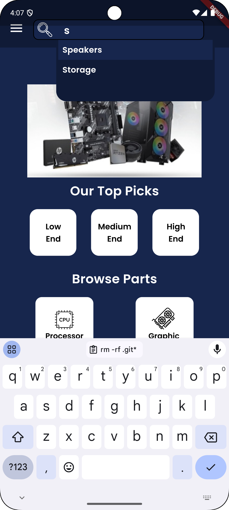

<h1 align="center">Tech Advisor Flutter App</h1>

## This project is a Flutter application for browsing and building PCs with functionalities like:

* User Signup/Signin (Email & Google)
* Browse and Collect PC Specs
* Build and Compare PC configurations
* Create, Comment, and Like Posts
* User Management (Favorites, Compatibility Checks)

## The project leverages Clean Architecture for separation of concerns and Bloc for state management, achieving:
* Modular Design: Clean architecture separates business logic, data access, and UI concerns.
* Testability: Independent layers allow easier unit and integration testing.
* Maintainability: Clear separation keeps code organized and scalable.
* Predictable State: Bloc provides a centralized state management solution.

## Project Structure
### The project follows a clean architecture approach:
* Domain: Contains business logic entities, abstraction repository and usecases (e.g., User, auth_repository, post_usecase).
* Data: Contains models, data source and handles data access through repositories implementation (e.g., UserRepository, SpecsRepository).
* Presentation: Defines UI widgets and interacts with Blocs (e.g., SignInScreen, BuildScreen).
* Bloc: Manages application state and exposes events and states for UI updates.

## State Management with Bloc
### Bloc is the chosen state management solution, providing:
* Events: Triggers state changes (e.g., UserLoggedInEvent, SpecAddedToFavoritesEvent).
* States: Represent application state at any given time (e.g., LoginLoadingState, SpecsLoadedState).
* Blocs: Contain business logic for handling events and emitting new states.

### The Presentation layer utilizes Blocs to:
* Dispatch events based on user interactions.
* Build UI based on the current state emitted by the Bloc.

## Dependencies
This project utilizes the following dependencies:
* flutter_lints: Enforces code quality and style consistency for a polished codebase.
* build_runner: Enables code generation tasks for improved development efficiency.
* analyzer: Provides advanced static code analysis for early detection of potential issues.
* flutter_native_splash: Handles splash screen customization for a captivating initial impression.
* cupertino_icons: Offers access to the Cupertino icon set for a visually appealing UI.
* equatable: Simplifies object comparison logic for streamlined development.
* dio: Enables efficient and flexible network communication for data fetching and interactions.
* firebase_core: Provides the foundation for Firebase integration.
* firebase_auth: Handles user authentication with Firebase's robust mechanism.
* bloc: The core state management library for managing application state.
* dartz: Facilitates working with functional programming concepts like Either.
* cloud_firestore: Interfaces with the NoSQL database Firebase Firestore for data storage.
* flutter_bloc: Streamlines integration of Bloc with Flutter for simplified state management.
* flutter_svg: Enables seamless integration of SVG images for a versatile UI.
* google_sign_in: Handles user authentication using Google Sign-In for user convenience.
* freezed: Provides succinct data structure creation and pattern matching capabilities.
* freezed_annotation: Generates boilerplate code for freezed data structures.
* animated_bottom_navigation_bar: Implements a sleek animated bottom navigation bar for intuitive navigation.
* url_launcher: Opens external links within the app, enhancing user experience.
* provider: Offers a dependency injection solution for managing dependencies throughout the application.
* get_it: Provides an alternative dependency injection approach.

## Screenshots:

## Getting Started
Clone the repository.
Install dependencies using flutter pub get.
Configure your Firebase project and set up credentials in the project.
Run the app using flutter run.
Contributing
Pull requests and bug reports are welcome! Please follow standard coding practices and provide clear descriptions for your contributions.

This README provides a high-level overview of the project's architecture and state management approach. Further details on specific implementations can be found within the codebase.
